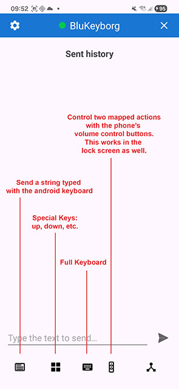
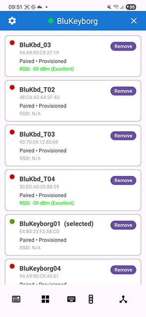
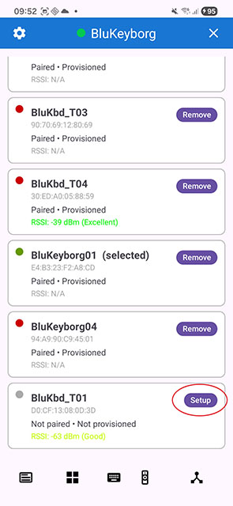
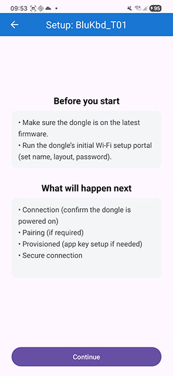
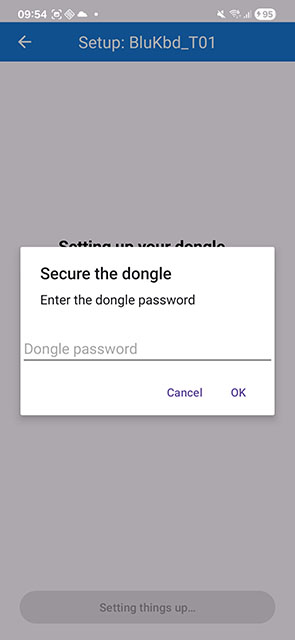
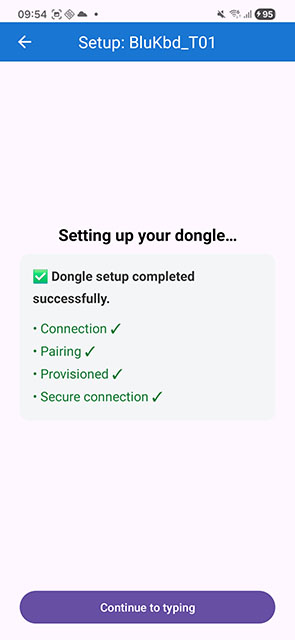
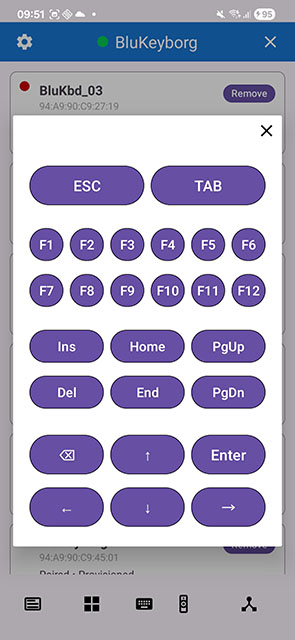

## 💙 BluKeyborg v2.0 — Multi-Device Management & Improved Setup Flow

BluKeyborg is an Android companion app for the **Blue Keyboard / BluKeyborg dongle**,
allowing you to securely send text, passwords, and keyboard commands to a host device
via BLE-to-USB HID.

The **v2.0 release** focuses on **multi-dongle usability**, a **reworked setup and
provisioning flow**, and tighter integration with recent firmware changes.

> ⚠️ **Firmware requirement:**  
> BluKeyborg v2.0 **requires Blue Keyboard firmware v2.1.0 or newer**.  
> Devices running older firmware will not be visible in the new device list.

For firmware releases, supported hardware, setup instructions, and technical details
about the dongle itself, see the main repository:

👉 **Blue Keyboard (Dongle & Firmware)**  https://github.com/larrylart/blue_keyboard

---

## 📱 App Overview (v2.0)

BluKeyborg v2.0 provides:

- A redesigned **Devices screen** for managing multiple dongles
- Explicit setup and provisioning per device
- Cleaner BLE device discovery using firmware-provided manufacturer data
- Secure provisioning and MTLS session handling
- Manual text sending and send history
- Full-screen keyboard and special-keys panels *(work in progress)*
- Integration points for password managers and external apps

---

## 🚀 What’s New in v2.0

### 🧩 New Devices Screen (Multi-Dongle Management)

A new **Devices** screen replaces the previous single-device–centric flow.

- All discovered dongles are shown in one place
- Each device has a clear state (unpaired / unprovisioned / ready)
- Setup and retry actions are device-specific
- Makes working with **multiple dongles or boards** significantly easier

---

### 📡 Filtered BLE Discovery (Firmware-Aware)

The device list is now **filtered using BLE manufacturer data** introduced in
**firmware v2.1.0**.

- Only compatible Blue Keyboard / BluKeyborg dongles are shown
- Other nearby BLE devices are filtered out
- Scanning is faster and far less confusing

> ⚠️ Dongles running **older firmware will not appear** in the device list.
> Update firmware to v2.1.0+ before using BluKeyborg v2.0.

---

### 🔧 Setup & Provisioning Moved to Devices

The dongle setup and provisioning flow has been **moved from Settings to the Devices screen**.

- Each unprovisioned dongle shows a **Setup** button
- Setup can be retried per device without global resets
- The flow better matches real-world usage and error recovery
- Improves clarity for first-time setup and troubleshooting

#### Devices & Setup Flow

#### Settings

---

### ⌨️ Special Keys & Full Keyboard (Ongoing Work)

Some updates and refinements were made to the **special keys panel** and the
**full-screen keyboard**.

- Layout and behavior adjustments
- Early iteration on usability improvements

> ⚠️ These areas are still **work in progress**.  
> The long-term direction depends on user feedback and actual usage patterns.

---

#### Control via Phone Buttons

---

## 🔐 Security & Architecture (Unchanged)

BluKeyborg v2.0 retains the same core security and architectural principles:

- BLE + application-level MTLS
- Centralized provisioning and key management
- BluKeyborg as the single BLE + security authority
- IPC / integration points for password managers

The changes in v2.0 are primarily **UX and flow improvements**, not a protocol rewrite.

---

## 📦 Installation

### 1. Download the APK
From GitHub Releases: [**Releases → BluKeyborg v2.0**](https://github.com/larrylart/blukeyborg-android/releases/tag/v2.0.0)

---

### 2. Update Firmware
Ensure your dongle is running **Blue Keyboard firmware v2.1.0 or newer**.

---

### 3. Open BluKeyborg → Devices
- Scan for devices
- Select your dongle
- Tap **Setup** if the device is not yet provisioned

---

### 4. Start Using
- Manual text sending
- Share text from other apps
- Password manager integrations
- Keyboard / special-keys panels

---

## 📢 Notes About v2.0

This release is primarily about **making BluKeyborg scale beyond a single dongle**:

- Better device discovery
- Clearer setup state per device
- Less confusion during provisioning
- Cleaner retry and recovery paths

Future work will continue to refine:
- Keyboard and special-keys UX
- Media / controller use cases
- Feature parity with iOS and Linux clients

---

💙 **Thank you for using BluKeyborg!**  
Usability, correctness, and security remain the core design goals.
