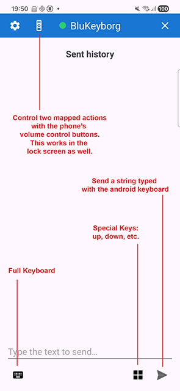
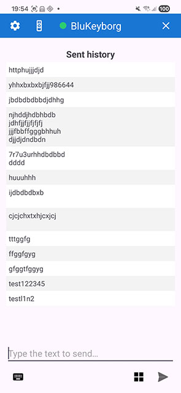
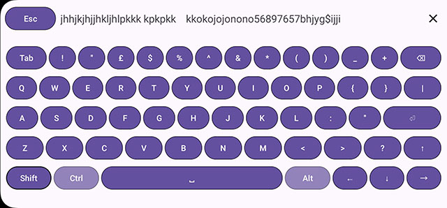
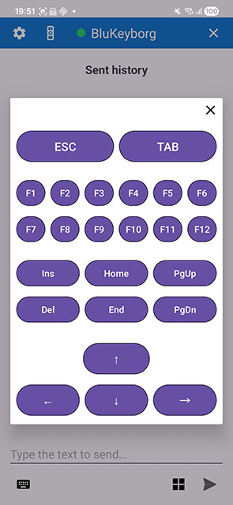
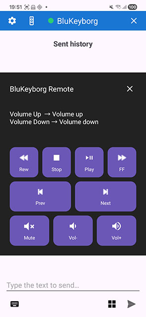
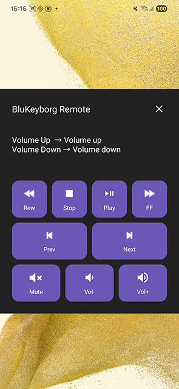
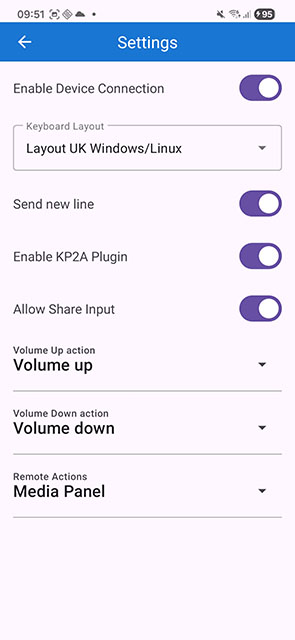

# 💙 BluKeyborg v1.0 — First Release

BluKeyborg is an Android companion app for the **Blue Keyboard Dongle**, allowing you to securely send text, passwords, and special keyboard commands to your computer/device through BLE-to-USB HID.

This **v1.0 first release** provides the complete user workflow:

**Type text on the phone → secure BLE transmission → dongle → USB HID typing on the host PC/Mac/Linux.**

---

## 📱 App Overview

BluKeyborg provides:

- A clean main screen for sending text  
- Automatic reconnection to the selected dongle  
- A full-screen raw keyboard  
- A special-keys panel (arrows, delete, function keys, etc.)  
- A send-history panel  
- A way to send two key codes using the phone volume up/down - configurable in settings
- Integration with the dongle's micro-command protocol for text and keycode transmission

---

## 🖼️ Screenshots

> Replace the image paths below with your actual screenshot files.

### Main Screen


### Send String


### Send History


### Full Keyboard



### Special Keys Panel


### Control via phone buttons



### Settings


---

## 🚀 Features in v1.0

### ✓ Manual Text Sending
Write any text in the input field and send it directly to the dongle.

BluKeyborg will:

- Send the text via BLE  
- Verify the dongle's response  
- Append the sent text to the history  
- Clear the input box after successful send  

---

### ✓ Send History (Session-Based)
The app shows a scrolling list of previously sent entries:

- Alternating white / light-gray rows  
- Auto-scrolls to the newest entry  
- History resets when the activity or process is recreated

---

### ✓ Full Keyboard Activity
A dedicated full-screen keyboard for raw HID typing:

- Launched when fast-keys mode is enabled  
- Automatically enables fast-keys if needed  
- Sends raw HID codes via `0xE0` micro-command  
- Closes via a top-right **X** icon  

---

### ✓ Special Keys Panel
Send HID keys such as:

- Arrow keys  
- Backspace / Delete  
- Enter / Tab  
- Escape  
- Home / End  
- Page Up / Page Down  
- Function Keys (F1–F12)

Each button sends a direct HID keycode to the dongle.

---

### ✓ Auto-Connect to Preferred Dongle
On app start or resume:

- Reads your selected dongle from preferences  
- Attempts automatic BLE connection  
- Shows a toast when unreachable  
- Never blocks the UI  
- Does **not** disable fast-keys mode  

---

### ✓ Minimal Permissions
The app requires:

- **Bluetooth / BLE permissions only**  
- No Internet  
- No storage  
- No location  
- No personal data access  

---

## 🔧 Internal Architecture (Simplified)

BluKeyborg communicates with the dongle using:

- BLE GATT writes & notifications  
- Text transmission + MD5 verification  
- Fast-key HID keycode mode  
- A connection manager (`BleHub`)  
- A device selector stored in shared preferences  

---

## 📦 Installation

### 1. Download the APK
From the GitHub Releases:

## Releases → BluKeyborg v1.0


### 2. Pair the Dongle
Inside BluKeyborg:

Settings → Output Device → Scan → Select your dongle


### 3. Start Sending Text
Use the text input box or open the full keyboard.

---

## 🗂️ Source Code Structure
```
app/src/main/java/com/blu/blukeyborg/
│
├── MainActivity.kt # Main UI: send text + local history
├── FullKeyboardActivity.kt # Raw HID full-screen keyboard
├── SpecialKeysActivity.kt # Arrow keys, delete, etc.
│
├── BleHub.kt # BLE protocol + device state handling
├── BluetoothDeviceManager.kt # Manages selected dongle prefs
│
└── BluKeyborgApp.kt # Application class / global init
```

---

## 📄 License

This project is released under the **MIT License**.  
See the `LICENSE` file for details.

---

## 🤝 Contributing

Pull requests are welcome!

You can contribute by:

- Improving UI / UX  
- Adding new keyboard layouts  
- Reporting bugs  
- Requesting new features  
- Optimizing BLE communication  

---

## 📢 Notes About v1.0

This is the first stable release of the BluKeyborg Android companion app.

Planned enhancements for the next releases:

- Encrypted binary protocol onboarding (MTLS)  
- Persistent send history  
- Improved full keyboard with layout matching  
- Support for multiple dongles  
- Better error reporting & diagnostics  

---

💙 **Thank you for using BluKeyborg!**  
More features and improvements are coming soon.
